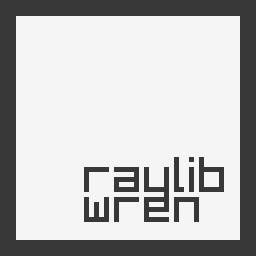

# raylib-wren (wray)

[Wren](https://wren.io) binding for [raylib](https://www.raylib.com/), a simple
and easy-to-use library to learn videogames programming.

This binding supports raylib 4.5, previous version may support earlier versions.

## Usage (wray_s)

wray_s is the simplest way to use raylib-wren.
You need to give it a module path which is script file with or without '.wren'.

```shell
./wray_s examples/core_basic_window.wren
```

## Usage (wray_e)

wray_e is the embedding-mode binary of raylib-wren.
It allows you to build a autonomous executable which can be ran on any computer
without the need of any runtime which can be very useful to distribute your
game.

To build a project as a autonomous, you need to call wray_e on a .wren file or
a project directory with a main.wren file.

```shell
./wray_e examples/core_basic_window
```

Currently, there is a limited support for loading embedded assets.
All assets type are supported however music files must be provided externally.

## Use as a external library (advanced)

Wray may be interesting to implement scripting in a raylib-based game.
Wray doesn't make any assumtion in raylib state in initialization (it is a bare
binding with few changes to work with Wren).

When building wray, you get a libwray.a, it requires `libwren.a` to work.
You can get `libwren.a` from `wren/lib/`

You can get wray header from `include/` and wren headers from `wren/src/include`.
You need to use `wray_new_vm` to make a Wren VM with wray loaded in.

A loader must be provided to properly load functions, otherwise, Wren will not
be able to load anything.

Check `src/wray_s.c` for a example.

## Building

To build raylib-wren from source, you need to take care that submodules are
imported, if not or you are unsure :

```shell
git submodule init
git submodule update
```

A Lua working interpreter is needed, by default luajit is used, to override it,
edit LUA variable in `makefile`.

## Example

```wren
import "raylib" for Raylib, Color, ConfigFlags

// Set config flags.
Raylib.configFlags = ConfigFlags.vsync
Raylib.targetFPS = 60

Raylib.initWindow(800, 450, "raylib [core] example - basic window")

while (!Raylib.windowShouldClose) {
	Raylib.beginDrawing()

	Raylib.clearBackground(Color.rayWhite)
	Raylib.drawText("Congrats! You created your first window!", 190, 200, 20, Color.lightGray)

	Raylib.endDrawing()
}

Raylib.closeWindow()
```

## Compatibility

raylib-wren is currently compatible with raylib 3.7 API.
Only a subset of the API supported, any contribution on API is welcome.

There is currently no support for rlgl, physac and raygui.

## Note for contributors / maintainers

### Adding/remove a function

- modify api/\*.wren
- modify corresponding src/wray_\*.c and src/wray_\*.h

### Type-checking

With WRAY_TYPE_CHECK build option, each call on the Wren C API check if the
type is the one expected, therefore, it will report errors and abort when an
invalid argument type is encountered.

The wray_CheckForeignType functions checks if the foreign is in the right type,
it should be used only if the foreign type could be wrong (e.g static class
method) call.

This option should only be used when developping a game with wray, it has a very
significant overhead.

If this option is disabled, Wren C API behave normally so no typecheck are made
and wray_CheckForeignType is no-op.

### Licence

Copyright (C) 2019-2023 Astie Teddy

Permission to use, copy, modify, and/or distribute this software for any
purpose with or without fee is hereby granted, provided that the above
copyright notice and this permission notice appear in all copies.

THE SOFTWARE IS PROVIDED "AS IS" AND THE AUTHOR DISCLAIMS ALL WARRANTIES
WITH REGARD TO THIS SOFTWARE INCLUDING ALL IMPLIED WARRANTIES OF
MERCHANTABILITY AND FITNESS. IN NO EVENT SHALL THE AUTHOR BE LIABLE FOR
ANY SPECIAL, DIRECT, INDIRECT, OR CONSEQUENTIAL DAMAGES OR ANY DAMAGES
WHATSOEVER RESULTING FROM LOSS OF USE, DATA OR PROFITS, WHETHER IN AN ACTION
OF CONTRACT, NEGLIGENCE OR OTHER TORTIOUS ACTION, ARISING OUT OF OR IN
CONNECTION WITH THE USE OR PERFORMANCE OF THIS SOFTWARE.
